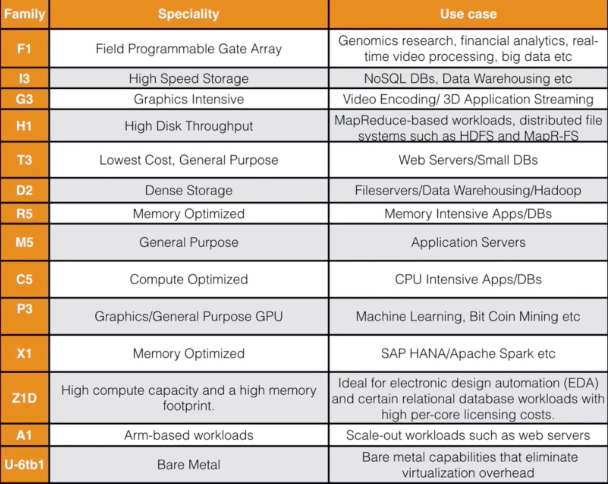
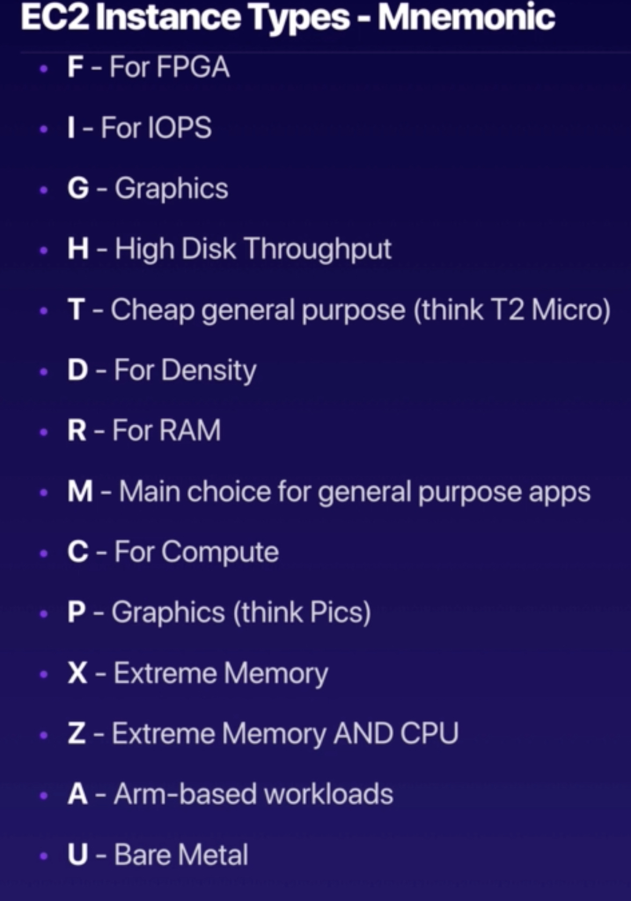

# Elastic Compute Cloud (EC2)

## Introduction

* provides sizeable compute capacity in the cloud
* reduces time required to obtain and boot new server instances to minutes
* short spin up time allows for quick scale capacity, up or down

## Pricing Models

* pay for what is used, as you go
* pay less as it is used more
* pay even less when you reserve capacity
* **ON DEMAND**
  * users wanting low cost and flexibility without any up-front payment or long term commitment
  * best for apps that are short term, spiky, or unpredictable workloads that cannot be interupted
  * **fixed rate pricing by the hour, min, sec, etc with no commitment**
* **RESERVED**
  * best for apps with steady state or predictable use that require reserved capacity
  * users able to make upfront payments to reduce total computing costs
  * provides **capactity reservation**, offer discount on the hourly charge with **contract term 1 or 3 years**
  * Pricing Types
    * Standard Reserved Instances
      * offer up to 75% off on demand instances
      * **more paid up front, the more available savings**
    * Convertible Reserved Instances
      * offer up to 54% off on demand instances
      * allows switching between Instance types for equal or greater value
    * Scheduled Reserve Instances
      * available to launch within reserved time window
      * allows for matching usage capacity to predictable times (everyone logging in at the same time)
* **SPOT**
  * only feasible for apps that require only low compute prices
  * for users with urgent computing needs for large amounts of additional capacity
  * **price bidding** available for when there is extra capacity. When that capacity is lost, an instance can potentiall by shut down in a matter of minutes
  * **best for apps with flexible start and end times**
  * if Spot instance terminated by AWS, will not be charged for partial hour
    * if instance is terminated by user, will be charged for **any hour in which the instance ran**
* **DEDICATED HOSTS**
  * useful for regulatory requirements that may not support multi-tenant virtualization
  * good for licensing which does not support multi-tenancy or cloud  deployments
  * can be purchased on demand at an hourly rate
  * can be purchased as a Reservation for up to 70% off the On-Demand price
  * **physical EC2 server dedicated for use**
  * reduce costs by using existing server-bound software licenses

* EC2 Instance Types *not needed for test but useful info*

* EC2 Mnemonic- Fight Dr Mcpxz in Australia

> *Next Up:* [**EC2 Lab Notes**](./ec2-lab-notes.md)

## Security Groups Basics

* **changes to Security Groups take effect immediately**
* Security Groups are **stateful** - a change to an inbound rule effects the outbound
* **cannot block a particular port or IP address within Security Groups**
  * **inbound traffic is blocked by default**
  * **all outbound traffic is allowed by default**
* **any number of EC2 instances for a Security Group**
* **multiple Security Groups can be attached to an EC2 Instance**
* cannot block certain IP addresses, instead have to use Network Access Control Lists
* can specify allow rules but not deny rules

> *Next Up:* [**Elastic Block Storage and Volumes**](./ebs-and-volumes.md)
> *Next Up:* [**AMI Types**](./ami-types.md)

## Encrypted Root Device Volumes & Snapshots

* *EBS Root Volumes of default AMIs cannot be encrypted*
* Snapshots of encrypted Volumes are encrypted automatically
* Volumes restored from encrypted Snapshots are encrypted automatically
* only unencrypted Snapshots can be shared
* Upon creation of EC2 Instance, the Root Volume can be encrypted
  * If you need to encrypt it at a later date, this is the process:
    * create snapshot of unencrypted root device volume
    * create copy of the Snapshot and select encryption type
    * create AMI from this copy
    * use AMI to launch new encrpyted Instance

> *Next Up:* [**CLoud Watch**](./cloud-watch.md)

## Elastic File System (EFS)

* AWS file storage service for EC2
* interface for creating and configuring a file system
* **supports Network File System version 4 (NFSv4) protocol**
* *can support thousands of NFS connections*
* storage capacity is elastic - *scale up to Petabytes*
  * shrinks and grows as files are removed or added
  * storage is there when it is needed - *no pre-provisoning required*
* **data is stored across multiple AZs in a Region**
* *read after write consistency*
* Lab Notes
  * enable life cycle management for files within system
    * choose time range to automatically move files to EFS IA storage class which is cheaper
* Confused about Storage systems? Check out this [*webpage*](https://help.acloud.guru/hc/en-us/articles/115002011194)

## Placement Groups

* ways to place EC2 Groups
* **name for Placement Group must be unique within AWS account**
* **only certain types of Instances can be launched into a Placement Group**
  * *Compute, Optimized, GPU, Memory Optimized, Storage Optimized*
* Placement Groups cannot be merged
* cannot move existing Instance into Placement Group
  * create an AMI from Instance and then launch new Instance from AMI into Placement Group
* 3 Types of Placement Groups:
  * **Clustered PlacementGroups**
    * a grouping of *homogenous* EC2 Instances within a *single AZ*
    * **good for low network latency and/or high througput apps**
  * **Spread Placement Groups**
    * **individual critical EC2 Instances across multiple pieces of hardware**
    * *can be in different AZ across one Region*
    * think single instance
  * **Partitioned**
    * can have **multiple EC2 Instances within a single partition**
    * HDFS, HBase, Cassandra
    * AWS EC2 divides each group into logical segments
    * *can be in different AZ across one Region*
    * each partition within each Placement Group has its own network and power source
    * no two partitions share the same rack which allows for failure isolation
    * think multiple instances
