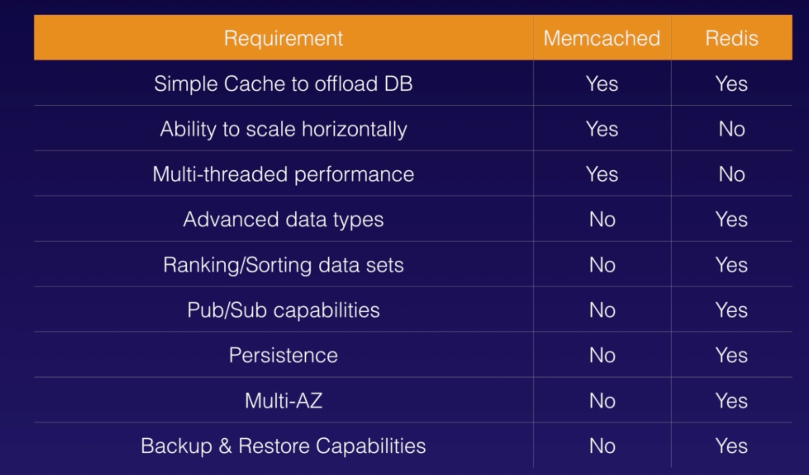

# AWS DATABASES

## Basic Database Info

* AWS manages the underlying operating systems for all of its databases
  * if you see a question about needing to access or manage the OS, an answer will most likely NOT include a DB

### Relational Databases

* relational database is like a spreadsheet
  * different sheets are like tables
    * rows within those tables
      * fields or columns within row
* **6 AWS Relational Databases**
  * SQL Server
  * Oracle
  * MySQL Server - port 3306
  * PostgreSQL
  * Aurora
  * MariaDB

> *Relational Database Service Notes* [RDS Notes](./relational-database-services.md)

### Non Relational Databases

* Collection = Table
  * Document = Row
    * Key Value Pairs = Fields
* **AWS DynamoDB**

> *Non-Relational Database Notes* [Non-Relational Notes](./non-relational-database.md)

### Data Warehousing

* used for business intelligence
* used to pull in large and complex data sets usually by management
* **Online Transaction Processing (OLTP) in RDS**
  * maximum size of RDS volume for RDS Provisioned IOPS storage = 16TB
  * more simple query to find data
* Online Analytics Processing (OLAP)
  * pulls in large amounts of data and does a lot of queries
* **AWS Data Warehouse Solution for OLAP = Redshift**

### ElastiCache

* ElastiCache is a web service that can deploy, operate, and scale in-memory cache in the cloud
  * **improves performance of existing databases for web apps by reducing access times**
  * store in key value pairs
  * frequent identical queries
  * supports 2 open source in-memory caching engines:
    * **MemcacheD**
      * can scale horizontally
    * **Redis**
      * Multi-AZ
      * Backups and restores of Redis
    * Differences between MemcacheD and Redis
    

> *Next Up:* [Aurora](./aurora.md)
