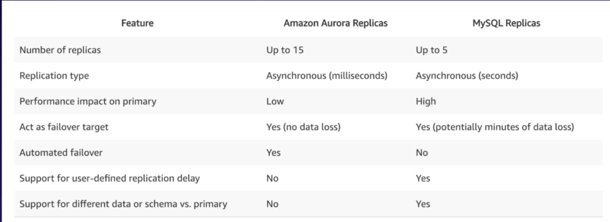

# AWS Arora

## Basic Info

* MySQL compatible, relational database engine
  * combines speed and availability of high end commercial databases with simplicity and cost-effectiveness of open source DBs
  * provides up to 5 times better performance than MySQL at price point 1/10th that of commercial DBs while delivering similar performance and availability
* Start with 10GB, scales in 10GB increments to 64TB (storage autoscaling)

* Compute resources can scale up to 32vCPUs and 244GB of Memory
* **2 copies of your data are contained in *each* AZ with minimum of 3 AZs**
  * **always have 6 copies of data across multiple AZs**

## Scaling Aurora

* designed to transparently handle the loss of up to 2 copies of data
  * this is without affecting database write availability
  * up to 3 copies without affecting read availability
* Aurora Storage is self healing
  * data blocks and disks continuously scanned for errors and repaired automatically

## Aurora Replicas

* 2 Types of Replicas Available
  * **Aurora Replicas** (currently 15)
    * only option with automated failovers
  * **MySQL Replicas** (currently 5)
  * Difference between the two Aurora Replica Types
  

## Aurora Backups

* **automated backups enabled by default**
* backups do not impact database performance
* can also take snapshots of Aurora (no impact performance)
* **Aurora snapshots can be shared with other AWS accounts**

> *Back to Database Notes:* [Databases README](./README.md)
