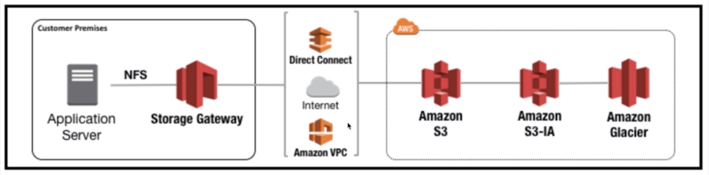
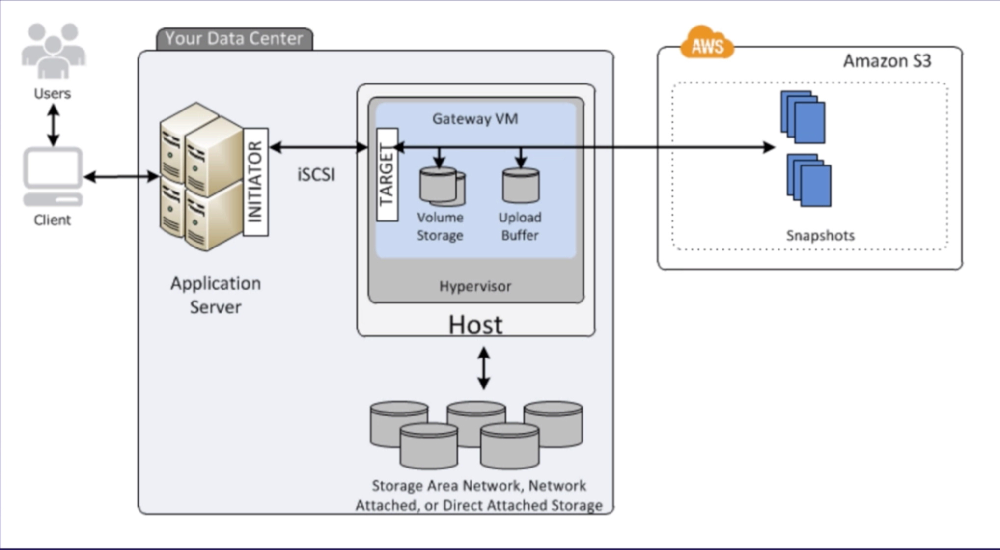
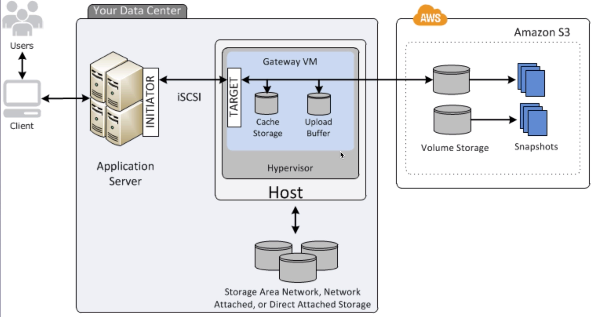

# Storage Gateway

* service that connects on-premise appliance with cloud based storage
  * provides seamless and secure integration between org's on-premise IT and AWS cloud infrastructure
  * enables secure storage of data to the Cloud for scaleable and cost-effective storage
* VM image installed on host within data center
  * VMware ESXi
  * Microsoft Hyper-V
  * Once created, use the AWS Management Console to create storage gateway option to meet needs

* 3 Types of Storage Gateways:
  * **File Gateway** (NFS & SMB)
    * store **flat files directly on S3**
    * NFS = Network File System mount point
    * metadata of object durably stores ownership, permissions, timestamps
    * once objects transferred to S3, all other S3 options become available (versioning, lifecycle, cross region, etc)
  * **Volume Gateway** **(iSCSI block protocol)**
    * store hard disk drives or virtual disks in S3
    * data written to volumes can be asynchronously backed up as snapshots and stored as AWS EBS snapshots
      * EBS = Elastic Block Storage
    * snapshots are compressed to minimize storage size
      * Stored Volumes
        * **entire dataset is stored on-premise and is asynchronously backed up to S3**
        * 1GB - 16TB
      * Cached Volumes
        * **entire dataset stored on S3 and most frequently accessed data is cahced on-premise**
        * mimize on-premise hardware while still providing low-latency access
        * 1GB - 32TB
  * **Virutal Tape Gateway** (VTL)
    * Virtual Tape Library
    * virtual or physical appliances
    * Supported by NetBackup, Backup Exec, Veeamm, etc
    * replicates Virtual Tapes to S3

  * File Gateway Diagram
  
  * Volume Gateway Diagram
  
  * Cached Gateway Diagram
  
  * Tape Gateway
  

  > *Back to S3 Notes:* [S3 README](./README.md)
