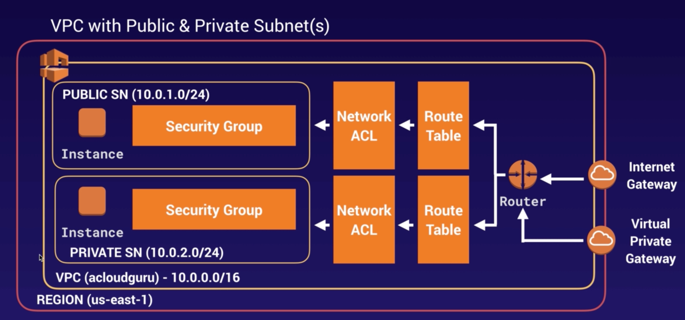

# Virtual Private Cloud (VPC)

## Basic Info

* exam suggestion: be able to build out a VPC by memory
* virtual data center in the cloud
* VPC lets you provision a logically isolated section of AWS Cloud
  * within this partition, launch AWS resources in a virtual network that you define
  * have complete control over virtual network environment
    * select IP addr range
    * creation of subnets
      * build a public facing subnet for web servers = Internet access
      * backend systems on private subnet = no Internet access
      * apply NACL's and Security Groups to fine tune Security of subnets
    * configure routing tables
    * configure network gateways
* can create a Hardware VPN connection between corporate data center and VPC
  * allows you to leverage AWS Cloud as an extension of corporate Datacenter
* VPCs consist of:
  * Internet Gateway
  * Virtual Private Gateway
  * Router
  * Route Table(s)
  * Network ACLs
  * Security Groups
  * Public or Private EC2 Instances

* AWS VPC Diagram
  * Note: Bastion Host(or Jump Box) is an EC2 Instance in a public subnet which can be used to connect to an EC2 in private subnet

> *Building a VPC Lab Notes:* [**VPC Lab Notes**](./vpc-lab-notes.md)
